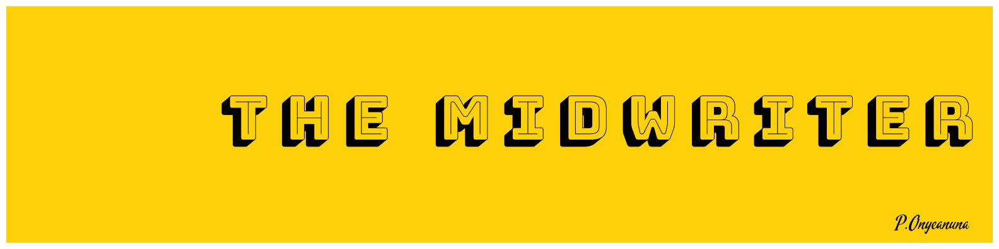

<h1 align="center">Hi 🤩, I'm Prince</h1>
<h3 align="left">

Experienced Technical Writer with expertise in creating API and developer documentation. I'm passionate about mentoring, open-source, and explaining complex problems into simple, actionable steps and procedures.

</h3>

- 🔭 I’m currently working on **creating amazing technical contents**
- 🌱 I’m currently learning **DITA**
- 👯 I’m looking to collaborate on **Open-source projects technical writer and a mentor**
- 📝 I regularly write articles on [Hashnode](https://aahil13.hashnode.dev/)
- 💬 If you're curious, you can ask me about **API and Product documentation**
- 📫 You can reach me via my email: **onyeanunaprince@gmail.com**
- ⚡ Fun fact, **I love Anime, hip-hop, and old school music**

## :writing_hand: Blog Posts
<!-- BLOG-POST-LIST:START -->
- [Introduction to Multi-Cluster Deployment in Kubernetes](https://dev.to/everythingdevops/introduction-to-multi-cluster-deployment-in-kubernetes-3ak3)
- [Monitoring, Observability, and Telemetry Explained](https://dev.to/everythingdevops/monitoring-observability-and-telemetry-explained-220)
- [How to Setup a Kubernetes Cluster with Minikube](https://dev.to/aahil13/how-to-setup-a-kubernetes-cluster-with-minikube-36j9)
- [How to Containerize an Application with Docker](https://dev.to/aahil13/how-to-containerize-an-application-with-docker-3i8m)
<!-- BLOG-POST-LIST:END -->

## 🔗 Connect with me 

## 🛠 Technical Writing Tools

Name | Badges
--- | --- 
**Tools & Platforms**  |          
**Technologies** |      
**Cloud & CI/CD** |      
**Documentation Domains** |     

 